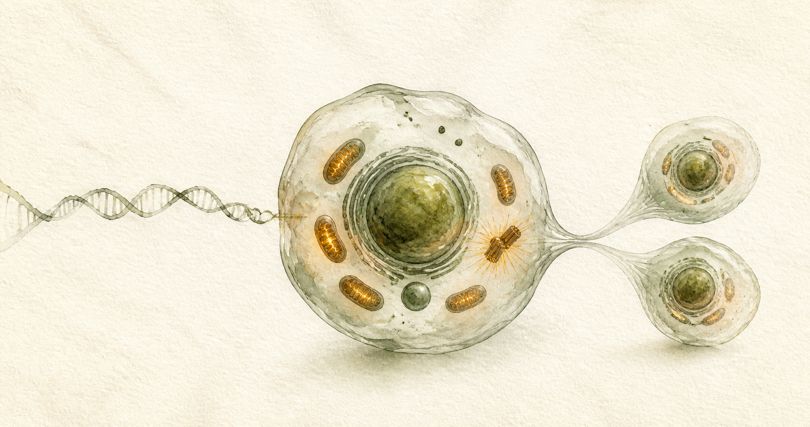

# 细胞 CELL

> 以“细胞分裂”为核心交互隐喻的个人事务管理程序。<br>
> A personal task manager built around cell division as its central interaction metaphor.

[中文](#中文) · [English](#english) · [在线站点 / Live Site](https://cell-lineage.lzw53155228.chatgpt.site/) · [中文作品展示 / Chinese Case Study](public/showcase.html)



## 中文

### 产品理念

细胞不是传统的 Todo List。你在前一天把明日计划写成“基因”，第二天这些基因会成为可执行的今日细胞。完成当前细胞后，下一组承诺才会通过分裂显现。

这个模型把任务从静态清单变成一个有生命周期的系统：规划、形成、生长、突变、分裂与成熟。

### 核心功能

- **前一天规划**：为明天录入事项、权重、预计时间、精力与子事项，并封存为明日基因。
- **当天执行**：封存的基因按顺序释放，每一代最多形成两个任务细胞。
- **细胞分裂**：只有当前一代全部解决后，中心体才会激活并释放下一代。
- **功能性细胞器**：细胞核承载当前事项，线粒体负责计时，核糖体对应子事项，溶酶体负责突变。
- **可控突变**：支持明日债务、事项交换和突变机会，并限制每周可用次数。
- **能量系统**：完成真实承诺会积累能量，部分重新协商行为会消耗能量。
- **细胞皮肤**：提供原生、凝胶、培养皿、卵黄、水墨和苔藓六种皮肤，以及随机模式。
- **细胞谱系**：保留每一代细胞的生长轨迹、状态和皮肤。
- **桌面细胞**：支持浏览器画中画悬浮窗口；不支持时使用可拖动的页面内桌面宠物。
- **本地保存**：计划、执行状态和偏好保存在当前浏览器中。

### 本地运行

环境要求：Node.js `>=22.13.0`

```bash
npm install
npm run dev
```

打开 [http://localhost:3000](http://localhost:3000)。

### 验证与构建

```bash
npm run lint
npm test
npm run build
```

### 技术栈

- React 19 + TypeScript
- vinext + Vite
- Cloudflare Workers / OpenAI Sites
- CSS 动画与响应式布局
- 浏览器 Local Storage
- Document Picture-in-Picture API（支持时启用）

### 数据说明

当前版本使用浏览器本地存储，不需要注册账号或连接数据库。清除站点数据会同时清除本地计划与细胞谱系。

在线站点目前采用私有访问设置。

独立中文展示页位于 [`public/showcase.html`](public/showcase.html)，可直接在浏览器中打开并打印为 PDF。

---

## English

### Product idea

CELL is not a traditional todo list. You encode tomorrow's plan as “DNA” the day before. On the target day, that DNA becomes executable cells. The next commitments only emerge through division after the current cells are resolved.

The model turns a static checklist into a living cycle of planning, formation, growth, mutation, division, and maturity.

### Core features

- **Plan the day before**: define tomorrow's tasks, weight, estimated time, energy, and subtasks, then seal them as DNA.
- **Execute today**: sealed DNA is released in order, forming up to two task cells per generation.
- **Cell division**: the centrosome activates and releases the next generation only after every cell in the current generation is resolved.
- **Functional organelles**: the nucleus holds the commitment, mitochondria manage time, ribosomes represent subtasks, and the lysosome controls mutation.
- **Controlled mutation**: use tomorrow debt, task exchange, or a mutation token under a weekly limit.
- **Energy system**: completing real commitments builds energy, while selected renegotiation actions consume it.
- **Cell skins**: choose Cell, Jelly, Petri, Yolk, Ink, Moss, or a random skin for future generations.
- **Cell lineage**: preserve each generation's growth trail, state, and appearance.
- **Desktop cell**: open the active cell in a browser Picture-in-Picture window, with a draggable in-page companion as fallback.
- **Local persistence**: plans, execution state, and preferences stay in the current browser.

### Run locally

Requirement: Node.js `>=22.13.0`

```bash
npm install
npm run dev
```

Open [http://localhost:3000](http://localhost:3000).

### Validate and build

```bash
npm run lint
npm test
npm run build
```

### Tech stack

- React 19 + TypeScript
- vinext + Vite
- Cloudflare Workers / OpenAI Sites
- CSS animation and responsive layout
- Browser Local Storage
- Document Picture-in-Picture API when supported

### Data and privacy

The current version stores data locally in the browser and does not require an account or database connection. Clearing site data also removes local plans and cell lineage history.

The hosted site currently uses private access.

The standalone Chinese portfolio case study is available at [`public/showcase.html`](public/showcase.html) and is optimized for browser viewing and PDF printing.

## License

No open-source license has been declared yet. All rights are reserved by the repository owner.
